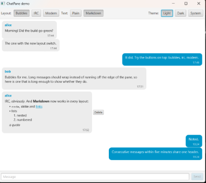
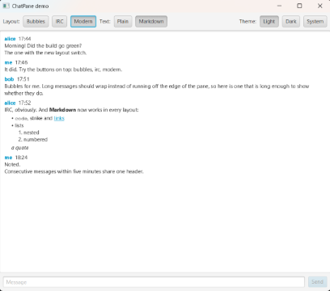

# ChatPane

 

A JavaFX control that shows a chat conversation — like Element/Matrix or WhatsApp — in a layout the application (and through it, its user) chooses:

| Layout | Looks like |
|--------|------------|
| `BUBBLES` | Talk bubbles: your messages on the right, everyone else's on the left (WhatsApp, Signal) |
| `IRC` | One line per message: `15:34 <bob> text` (IRC clients) |
| `MODERN` | Message by message, left-aligned, one sender header per group of consecutive messages (Element, Slack) |

Switching the layout re-renders the same conversation; nothing is lost.
Message text is selectable and copyable with the standard context menu and shortcuts; in `IRC` and `MODERN` the whole conversation is one read-only document, so a selection runs across messages and copies as a plain-text log.
The pane only displays: composing and sending is up to the application (the demo shows an input line next to it).
The pane is a standard JavaFX control (`Control` + skin + user-agent stylesheet, [MADR 0009](docs/decisions/0009-standard-javafx-control-architecture.md)) and a named Java module, `org.jabref.chatpane`.
It brings no palette of its own: it takes its colors from the application's theme, so it looks native wherever it is dropped in ([MADR 0007](docs/decisions/0007-standard-modena-lookups-and-css-hooks.md)).

Status: early.
The three layouts, Markdown bodies, message actions, message status and live updates work; next steps are in [PLAN.md](PLAN.md).

Vibecoded with 🤖 Claude Opus 5.

`IRC` and `MODERN` render with JavaFX's `RichTextArea`, which is still an **incubator** module (`jfx.incubator.richtext`, [MADR 0010](docs/decisions/0010-richtextarea-transcript-for-irc-and-modern.md)): its API may change between JavaFX releases, and it prints an incubator warning at startup.
The library requires it, so a modular application gets it resolved automatically; on the class path the jar just has to be there (it is a dependency of the library).

## Usage

```java
ChatPane chat = new ChatPane();
chat.setMessageLayout(MessageLayout.BUBBLES);
chat.setTimeFormatter(DateTimeFormatter.ofPattern("HH:mm")); // optional; default: the locale's short time
chat.setMessageRenderer(MessageRenderer.markdown());          // optional; default: plain text
chat.setLinkHandler(url -> hostServices.showDocument(url));    // optional; without it, links are inert
chat.getMessageActions().add(MessageAction.of("Delete", m -> chat.getMessages().removeIf(x -> x == m)));
chat.setTextLocalizer(Localization::lang);                     // optional; the pane's own texts, see below

// A generated answer: pending, growing in place, then sent (or Status.ERROR).
chat.getMessages().add(new ChatMessage("assistant", "…", Instant.now(), Direction.INCOMING, Status.PENDING));
int last = chat.getMessages().size() - 1;
chat.getMessages().set(last, chat.getMessages().get(last).withText("The answer so far"));
chat.getMessages().set(last, chat.getMessages().get(last).withStatus(Status.SENT));
chat.getMessages().add(new ChatMessage("alice", "Hi!", Instant.now(), Direction.INCOMING));
chat.getMessages().add(new ChatMessage("me", "Hello.", Instant.now(), Direction.OUTGOING)); // right-hand side
```

In a modular application:

```java
module my.app {
    requires org.jabref.chatpane; // brings javafx.controls transitively
}
```

Message texts go through a `MessageRenderer` — the hook for how bodies read.
`MessageRenderer.markdown()` ([commonmark-java](https://github.com/commonmark/commonmark-java), with strikethrough) covers headings, emphasis, inline and block code, links, bullet and numbered lists, block quotes; HTML is shown as text, and a single line break stays a line break.
An application can plug in its own renderer; it returns the library's small `TextLine`/`TextSpan` model, which every layout shows alike ([MADR 0011](docs/decisions/0011-message-renderer-hook-with-commonmark.md)).

Replacing one message (`set(index, …)`) updates it in place in every layout: the rest of the conversation, the scroll position and the user's selection stay.
Message actions appear in the message's context menu (after *Copy* and *Select All*, which every message text has) and, in `BUBBLES`, as buttons next to the bubble under the pointer; `MessageAction.onlyFor(…)` limits one to the messages it fits, e.g. *Retry* to failed ones.
The pane shows two texts of its own, `ChatPane.TEXT_COPY` ("Copy") and `ChatPane.TEXT_SELECT_ALL` ("Select All"); the text localizer gets the English text and returns what to show.
`ChatMessage.Status` is `SENT`, `PENDING` or `ERROR`: the pane marks pending and failed messages without a color of its own (dimmed, italic, a dashed outline) — color them in CSS if you want.

The library logs through the SLF4J API ([MADR 0005](docs/decisions/0005-slf4j-api-with-tinylog-backend.md)); its messages land in whatever SLF4J backend the application uses.

## CSS reference

The default look lives in the control's user-agent stylesheet, so any application stylesheet overrides it.
Colors come only from the standard Modena lookups (`-fx-accent`, `-fx-base`, `-fx-background`, `-fx-control-inner-background`, `-fx-text-background-color`, `-fx-text-inner-color`); sizes are in `em`.
`BUBBLES` is a `ListView` of cells with a read-only `RichTextArea` body each; `IRC` and `MODERN` are the *transcript*, one read-only `RichTextArea` for the whole conversation.
Text in both is drawn by `RichTextArea` from style names: write rules for the names below and use `-fx-fill`, not `-fx-text-fill` (the area resolves the names into styles; the shown `Text` nodes do not carry them).

| Selector | Node | Notes |
|----------|------|-------|
| `.chat-pane` | the `ChatPane` | pseudo-classes `:bubbles`, `:irc`, `:modern` for the active layout |
| `.chat-pane-list` | the `ListView` (`BUBBLES`) | also a standard `.list-view` |
| `.message-cell` | one row (`BUBBLES`) | also a standard `.list-cell`; pseudo-classes `:incoming` / `:outgoing`, `:sent` / `:pending` / `:error`, and `:continued` when the message continues its sender's group (no sender name) |
| `.message-bubble` | the bubble | sets `-fx-background` (`-fx-base`, `-fx-accent` when outgoing); its labels ladder their text color against it |
| `.message-sender`, `.message-time` | the labels in a bubble | also standard `.label`s |
| `.message-body` | the body in a bubble | a read-only standard `.rich-text-area`, flattened to text — selection, *Copy* and the context menu work as everywhere in JavaFX |
| `.message-actions`, `.message-action` | the box of action buttons next to a bubble, and each button | standard `.button`s; shown while the pointer is over the row |
| `.message-menu` | the context menu of message text | a standard `.context-menu`; the action items carry `.message-action` |
| `.chat-pane-transcript` | the `RichTextArea` (`IRC`, `MODERN`) | also a standard `.rich-text-area`; its content padding is set here (wrapping and caret are fixed in code: CSS that sets them again breaks the incubator area, `docs/workarounds.md` W6) |
| `.style-probe` | an invisible `Label` in the skin | its background lists the lookups the text uses; when CSS changes them, the text is redrawn — if you restyle the text from other lookups, add them here |

Style names of the text (transcript and bubble bodies alike):

| Style name | On | Notes |
|------------|----|-------|
| `message-time`, `message-sender` | the time and sender of a transcript line | |
| `message-text` | every run of message text | |
| `incoming`, `outgoing`, `sent`, `pending`, `error`, `continued` | every run of a message | its direction and status; `continued` when it continues its sender's group |
| `line-paragraph`, `line-heading`, `line-quote`, `line-list-item`, `line-code-block` | the runs of a rendered line | plus `line-heading-1` … `line-heading-6` |
| `span-bold`, `span-italic`, `span-code`, `span-strikethrough`, `span-link` | a styled run | |

| CSS property | On | Values | Default |
|--------------|----|--------|---------|
| `-cp-message-layout` | `.chat-pane` | `bubbles`, `irc`, `modern` | `modern` |

Example — green outgoing bubbles, IRC layout by default:

```css
.chat-pane { -cp-message-layout: irc; }
.chat-pane .message-cell:outgoing .message-bubble { -fx-background: #2e7d32; }
```

## Getting it

Releases are on [Maven Central](https://central.sonatype.com/artifact/org.jabref/chatpane), one per day with changes, versioned by date (`2026.09.22`, see [CHANGELOG.md](CHANGELOG.md)):

```kotlin
dependencies {
    implementation("org.jabref:chatpane:2026.09.22")
}
```

Every push to `main` publishes `main-SNAPSHOT` to the [Maven Central snapshot repository](https://central.sonatype.com/repository/maven-snapshots/):

```kotlin
repositories {
    maven("https://central.sonatype.com/repository/maven-snapshots/")
}
```

`gradlew :chatpane:publishToMavenLocal` installs `main-SNAPSHOT` into the local Maven repository instead.
The library does not pick JavaFX's platform jars; the application does, as for any JavaFX library.

## Demo

```
gradlew :demo:run
```

opens a sample conversation with toggles for the layout and the text format (top left), a light/dark/system theme toggle (top right) and an input line; a pretend assistant answers every message the way an AI chat does (pending, growing in place, then sent — or failed if you write "fail", with *Retry*); `gradlew :demo:run --args="--layout=bubbles --theme=dark"` (or `just demo --layout=bubbles --theme=dark`) starts in a given layout and theme.
The dark theme is the demo's own stylesheet over Modena's variables — the library brings none.
The demo is itself a named module and runs on the module path, logging through tinylog.

## Building

Java 25 is fetched by the Gradle toolchain if missing.

```
gradlew build traceRequirements   # compile, unit tests, requirement tracing
gradlew uiTest                    # TestFX UI tests, need a display (just uitest: Xvfb on Linux)
```

## Documentation

* [docs/requirements/](docs/requirements/README.md) — features, requirements and designs, traced to code with OpenFastTrace
* [docs/decisions/](docs/decisions/README.md) — architectural decision records (MADR)
* [docs/workarounds.md](docs/workarounds.md) — workarounds for upstream issues, and when each can go
* [CHANGELOG.md](CHANGELOG.md) — user-visible changes by date

## License

[Apache License 2.0](LICENSE).
